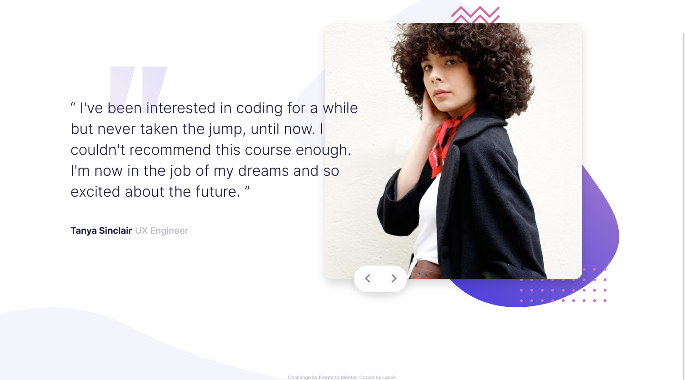

# Frontend Mentor - Coding bootcamp testimonials slider solution

This is a solution to the [Coding bootcamp testimonials slider challenge on Frontend Mentor](https://www.frontendmentor.io/challenges/coding-bootcamp-testimonials-slider-4FNyLA8JL). Frontend Mentor challenges help you improve your coding skills by building realistic projects. 

## Table of contents

- [Overview](#overview)
  - [The challenge](#the-challenge)
  - [Screenshot](#screenshot)
  - [Links](#links)
- [My process](#my-process)
  - [Built with](#built-with)
  - [What I learned](#what-i-learned)
  - [Continued development](#continued-development)
  - [Useful resources](#useful-resources)
- [Author](#author)
- [Acknowledgments](#acknowledgments)

## Overview

### The challenge

Users should be able to:

- View the optimal layout for the component depending on their device's screen size
- Navigate the slider using either their mouse/trackpad or keyboard

### Screenshot

### Links

- Live Site URL: [Coding bootcamp testimonials slider](https://leslief10.github.io/coding-bootcamp-testimonials/)

## My process

### Built with

- Semantic HTML5 markup
- CSS custom properties
- Flexbox
- CSS Grid
- Mobile-first workflow
- JavaScript

### What I learned

This was a bit of a tricky challenge because it was the first time I had properly worked with querySelectorAll, and forEach so I wasn't entirely sure what to do. Thankfully there's a lot of information online, and after a few trials and errors, I was able to get the functionality down.
### Continued development

I need to practice my animations/transitions/transformations, because I feel like the end result would look better when transitioning between the testimonials. This is something that I'll practice in the future.

## Author

- Website - [Leslie Fernandez](https://github.com/leslief10)

## Acknowledgments

Shoutout to the Frontend Mentor community. Whenever I'm stuck with something, it's super helpful to see their solutions to have an idea on how to proceed.
